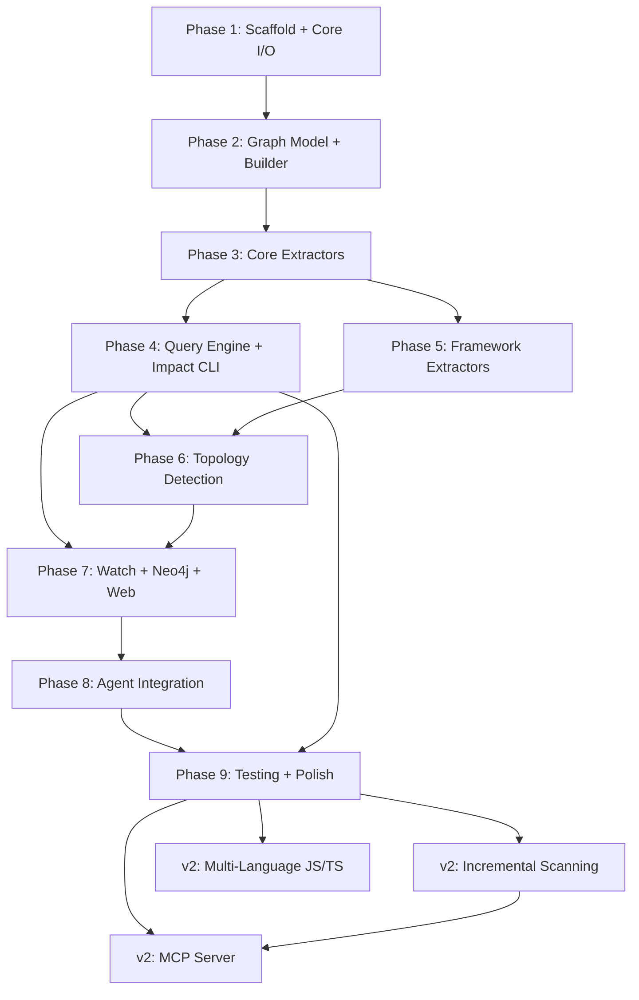

# Constrictor Development Plan

Static dependency and blast-radius analyzer for Python codebases.
Built for AI agents working on Python repositories.

---

## How to Use This Document

Each phase is **self-contained and shippable**. After completing a phase, the tool
does something useful -- you never have a half-built artifact. Tests are written
alongside code in every phase, not deferred to the end.

Phases are ordered by dependency: Phase N assumes Phases 1 through N-1 are done.
Within a phase, tasks are listed in implementation order.

**Notation:**
- `[file]` = create new file
- `[mod]` = modify existing file
- `[test]` = test file
- Checkboxes track completion

---

## Phase 1: Project Scaffold and Core Infrastructure

**Goal:** A pip-installable package that can scan a directory, respect ignore
patterns, and parse every `.py` file into an AST. No graph yet -- just the I/O
foundation everything else builds on.

**After this phase:** `constrictor scan /some/path` discovers files and reports
what it found (file count, parse errors). Nothing more.

### Tasks

- [ ] **1.1 Project skeleton**
  - `[file] pyproject.toml` -- package metadata, dependencies, `[project.scripts]` entry point
  - `[file] src/constrictor/__init__.py` -- version string (`__version__ = "0.1.0"`)
  - `[file] src/constrictor/core/__init__.py`
  - `[file] src/constrictor/graph/__init__.py`
  - `[file] src/constrictor/analysis/__init__.py`
  - `[file] src/constrictor/export/__init__.py`
  - `[file] src/constrictor/cli/__init__.py`
  - `[file] src/constrictor/agent/__init__.py`
  - `[file] src/constrictor/web/__init__.py`
  - `[file] tests/__init__.py`
  - `[file] .constrictor_ignore` -- default ignore patterns for the project itself
  - `[file] .gitignore`

  ```toml
  # pyproject.toml key sections
  [project]
  name = "constrictor"
  version = "0.1.0"
  requires-python = ">=3.10"
  dependencies = [
      "pydantic>=2.0",
      "networkx>=3.0",
      "typer>=0.9",
      "rich>=13.0",
      "watchfiles>=0.20",
      "fastapi>=0.100",
      "uvicorn>=0.23",
      "jinja2>=3.1",
      "pyyaml>=6.0",
  ]

  [project.scripts]
  constrictor = "constrictor.cli.main:app"

  [project.optional-dependencies]
  dev = ["pytest>=7.0", "pytest-cov", "ruff", "mypy"]

  [build-system]
  requires = ["hatchling"]
  build-backend = "hatchling.build"

  [tool.hatch.build.targets.wheel]
  packages = ["src/constrictor"]

  [tool.pytest.ini_options]
  testpaths = ["tests"]

  [tool.ruff]
  target-version = "py310"
  ```

- [ ] **1.2 Core data models** -- `[file] src/constrictor/core/models.py`
  - `Certainty` enum: `UNRESOLVED = 0`, `AMBIGUOUS = 1`, `INFERRED = 2`, `EXACT = 3`
  - `SourceLocation(BaseModel)`: `file_path: str`, `line: int | None`, `column: int | None`
  - `ScanOptions(BaseModel)`: `root_path: Path`, `max_depth: int = 64`, `exclude_patterns: list[str] = []`, `include_tests: bool = False`
  - `ScanWarning(BaseModel)`: `code: str`, `message: str`, `path: str | None`, `certainty: Certainty`
  - `StageTiming(BaseModel)`: `stage: str`, `elapsed_seconds: float`
  - `ScanMetadata(BaseModel)`: `root_path: str`, `started_at: datetime`, `completed_at: datetime`, `python_version: str`, `constrictor_version: str`, `timings: list[StageTiming]`
  - `ScanStatistics(BaseModel)`: counts for each node and edge type (filled in later by the builder)

- [ ] **1.3 Ignore file loader** -- `[file] src/constrictor/core/ignore.py`
  - `load_ignore_patterns(root_path: Path, extra_exclude_files: list[Path] | None, extra_patterns: list[str] | None) -> list[str]`
  - Reads `.constrictor_ignore` from root if it exists
  - Supports `#` comments, blank lines, glob patterns, bare directory names
  - Merges patterns from `--exclude-file` paths and `--exclude` CLI args
  - Hardcoded defaults always included: `__pycache__`, `.git`, `.venv`, `venv`, `env`, `.env`, `node_modules`, `.tox`, `.nox`, `.mypy_cache`, `.pytest_cache`, `.ruff_cache`, `*.egg-info`, `dist`, `build`
  - `should_exclude(path: Path, patterns: list[str]) -> bool` using `fnmatch` or `pathlib.match`

- [ ] **1.4 Directory scanner** -- `[file] src/constrictor/core/scanner.py`
  - `ScanResult(BaseModel)`: `python_files: list[Path]`, `config_files: list[Path]`, `warnings: list[ScanWarning]`
  - `scan_directory(options: ScanOptions) -> ScanResult`
  - Walks the tree with `os.walk()`, respects ignore patterns, enforces `max_depth`
  - Collects `.py` files into `python_files`
  - Collects topology config files into `config_files`: `docker-compose.yml`, `docker-compose.yaml`, `Dockerfile`, `Procfile`, `pyproject.toml`, `setup.py`, `setup.cfg`
  - Handles symlink loops by tracking visited real paths
  - Emits `ScanWarning` for permission errors, broken symlinks

- [ ] **1.5 AST parser** -- `[file] src/constrictor/core/parser.py`
  - `ParsedModule` dataclass: `file_path: Path`, `module_name: str` (dot-qualified), `ast_tree: ast.Module`
  - `parse_file(file_path: Path, root_path: Path) -> ParsedModule | None`
    - Reads file, calls `ast.parse(source, filename=str(file_path))`
    - On `SyntaxError`: returns `None`, caller logs a `ScanWarning`
    - On `UnicodeDecodeError`: returns `None` (binary file masquerading as .py)
    - Computes `module_name` from relative path: `src/constrictor/core/scanner.py` -> `constrictor.core.scanner`
  - `parse_all(files: list[Path], root_path: Path) -> tuple[list[ParsedModule], list[ScanWarning]]`
    - Parses every file, collects warnings for failures, returns both

- [ ] **1.6 Minimal CLI entry point** -- `[file] src/constrictor/cli/main.py`
  - Typer app with a single `scan` command for now (just discovery, no graph yet)
  - `constrictor scan <path> [--exclude ...] [--verbose]`
  - Output: prints file count, parse success/failure count, any warnings
  - This is a scaffold -- it will be extended in Phase 4

- [ ] **1.7 Install and verify**
  - `pip install -e ".[dev]"`
  - `constrictor scan .` should discover its own source files and report counts

### Tests

- `[test] tests/test_ignore.py` -- patterns matching, comment handling, default excludes
- `[test] tests/test_scanner.py` -- file discovery, symlink handling, exclusion
- `[test] tests/test_parser.py` -- valid parse, syntax error handling, binary file handling
- `[file] tests/fixtures/simple_project/` -- minimal Python project with 5-6 files:
  ```
  simple_project/
    app/
      __init__.py
      main.py          # imports utils, calls greet()
      utils.py          # defines greet(), helper()
      models.py         # defines User class
    tests/
      test_main.py
    setup.py
  ```

### Verification

```bash
pip install -e ".[dev]"
pytest tests/test_ignore.py tests/test_scanner.py tests/test_parser.py -v
constrictor scan tests/fixtures/simple_project/
# Expected: "Discovered 5 Python files. Parsed 5/5 successfully."
```

---

## Phase 2: Graph Data Model and Builder

**Goal:** The normalized graph schema (nodes, edges, document) and the builder
that accumulates them. JSON export so the graph can be written to disk.

**After this phase:** You can programmatically construct a graph, serialize it
to JSON, and load it back. No extractors yet -- the builder is tested with
manually constructed nodes/edges.

### Tasks

- [ ] **2.1 Graph models** -- `[file] src/constrictor/graph/models.py`
  - `NodeType` enum: `MODULE`, `PACKAGE`, `CLASS`, `FUNCTION`, `METHOD`, `ENDPOINT`, `VARIABLE`, `DECORATOR`, `SQLALCHEMY_MODEL`, `TABLE`, `EXTERNAL_MODULE`, `EXTERNAL_SERVICE`, `EXTERNAL_ENDPOINT`, `SERVICE`, `COMPONENT`
  - `EdgeType` enum: `IMPORTS`, `IMPORTS_FROM`, `CALLS`, `RETURNS`, `INHERITS`, `IMPLEMENTS`, `CONTAINS`, `DECORATES`, `EXPOSES_ENDPOINT`, `INJECTS_DEPENDENCY`, `CALLS_HTTP`, `DEFINES_MODEL`, `HAS_COLUMN`, `FOREIGN_KEY`, `TYPE_ANNOTATED`, `CROSSES_COMPONENT_BOUNDARY`, `BELONGS_TO_SERVICE`, `AMBIGUOUS`
  - `GraphNode(BaseModel)`: `id`, `type`, `name`, `qualified_name`, `display_name`, `file_path`, `line_number`, `column`, `certainty`, `metadata: dict[str, str]`
  - `GraphEdge(BaseModel)`: `id`, `source_id`, `target_id`, `type`, `display_name`, `file_path`, `line_number`, `certainty`, `metadata: dict[str, str]`
  - `GraphDocument(BaseModel)`: `nodes`, `edges`, `scan_metadata`, `warnings`, `unresolved`, `statistics`
  - `GraphSubgraph(BaseModel)`: `focus_node: GraphNode`, `nodes: list[GraphNode]`, `edges: list[GraphEdge]`
  - `GraphPath(BaseModel)`: `nodes: list[GraphNode]`, `edges: list[GraphEdge]`
  - `GraphPathResult(BaseModel)`: `from_node`, `to_node`, `paths: list[GraphPath]`
  - `AmbiguousReview(BaseModel)`: `unresolved_edges`, `ambiguous_edges`

- [ ] **2.2 ID factory** -- `[file] src/constrictor/graph/id_factory.py`
  - `create_id(prefix: str, *parts: str) -> str`
  - Concatenates parts with `|`, SHA256-hashes, takes first 16 hex chars
  - Format: `{prefix}:{hash}` e.g. `func:a1b2c3d4e5f6a7b8`
  - Deterministic: same inputs always produce the same ID across runs

- [ ] **2.3 Graph builder** -- `[file] src/constrictor/graph/builder.py`
  - `GraphBuilder` class with:
    - `add_node(id, type, name, ...) -> GraphNode` -- if ID exists, merge metadata, keep higher certainty
    - `add_edge(source_id, target_id, type, ...) -> GraphEdge` -- auto-generates edge ID via id_factory, merges if exists
    - `build(scan_metadata, warnings) -> GraphDocument` -- sorts nodes/edges, computes statistics, separates unresolved warnings
  - Merge logic follows dede pattern: higher certainty wins, metadata dictionaries merge (existing keys preserved, new keys added, conflicting values concatenated with ` | `)

- [ ] **2.4 JSON export** -- `[file] src/constrictor/export/json_export.py`
  - `export_json(document: GraphDocument, path: Path | None, pretty: bool = True) -> str`
  - Uses `document.model_dump(mode="json")` with sorted keys
  - Writes to file if `path` given, otherwise returns JSON string
  - `load_json(path: Path) -> GraphDocument` -- deserializes back

- [ ] **2.5 Summary generator** -- `[file] src/constrictor/export/summary.py`
  - `generate_summary(document: GraphDocument) -> str`
  - One-paragraph human-readable text: file counts, node type counts, edge type counts, warning counts
  - Designed to be useful both in CLI output and as context for an AI agent

### Tests

- `[test] tests/test_id_factory.py` -- determinism, uniqueness, format
- `[test] tests/test_graph_builder.py` -- add nodes, add edges, merge semantics, build finalization
- `[test] tests/test_json_export.py` -- round-trip serialize/deserialize, stable ordering

### Verification

```python
# In a test or script:
from constrictor.graph.builder import GraphBuilder
from constrictor.graph.models import NodeType, EdgeType
from constrictor.core.models import Certainty

builder = GraphBuilder()
mod_a = builder.add_node("mod:a", NodeType.MODULE, "app.main", ...)
mod_b = builder.add_node("mod:b", NodeType.MODULE, "app.utils", ...)
builder.add_edge("mod:a", "mod:b", EdgeType.IMPORTS, "main -> utils")
doc = builder.build(scan_metadata, warnings=[])
json_str = export_json(doc, pretty=True)
# Confirm valid JSON with correct structure
```

---

## Phase 3: Core Python Extractors

**Goal:** The three foundational extractors that work on any Python project:
imports, function calls, and class hierarchy. The contributor protocol that all
extractors implement. The scan orchestrator that ties scanner + parser +
extractors + builder together.

**After this phase:** `constrictor scan <path> -o graph.json` produces a real
dependency graph for any Python project, with import edges, call edges, and
inheritance edges.

### Tasks

- [ ] **3.1 Contributor protocol** -- `[file] src/constrictor/analysis/base.py`
  - `GraphContributor` Protocol class:
    ```python
    class GraphContributor(Protocol):
        name: str
        def contribute(
            self,
            parsed_modules: list[ParsedModule],
            builder: GraphBuilder,
            warnings: list[ScanWarning],
        ) -> None: ...
    ```

- [ ] **3.2 Import extractor** -- `[file] src/constrictor/analysis/imports.py`
  - Walks every `ast.Import` and `ast.ImportFrom` node in each module
  - For each import:
    - Creates a `MODULE` node for the current file (if not already added)
    - Creates a `MODULE` or `EXTERNAL_MODULE` node for the target
    - Creates an `IMPORTS` or `IMPORTS_FROM` edge
  - Distinguishes local vs stdlib vs third-party using `sys.stdlib_module_names` (3.10+) and checking if the target resolves to a file under `root_path`
  - Relative imports (`.foo`, `..bar`): resolve against the importing module's package path
  - Unresolvable targets: create node with `Certainty.UNRESOLVED`

- [ ] **3.3 Call graph extractor** -- `[file] src/constrictor/analysis/calls.py`
  - Walks `ast.FunctionDef` / `ast.AsyncFunctionDef` to find function definitions
  - Within each function body, walks `ast.Call` nodes
  - Resolves call targets:
    - Simple name: `foo()` -> look up `foo` in module scope
    - Attribute: `self.bar()` -> method `bar` on the enclosing class
    - Chained: `module.func()` -> look up `module` in imports, resolve `func`
  - Creates `FUNCTION` / `METHOD` nodes and `CALLS` edges
  - Creates `CONTAINS` edges from `MODULE` -> `FUNCTION` and `CLASS` -> `METHOD`
  - Unresolvable calls: edge with `Certainty.INFERRED` or `AMBIGUOUS`

- [ ] **3.4 Class hierarchy extractor** -- `[file] src/constrictor/analysis/classes.py`
  - Walks `ast.ClassDef` nodes
  - Creates `CLASS` node for each class
  - For each base class:
    - Resolve to a known class node if possible
    - Create `INHERITS` edge
    - Detect `ABC`, `Protocol` subclasses -> mark `IMPLEMENTS` edges
  - `CONTAINS` edges from `MODULE` -> `CLASS`
  - Extracts all methods (including `__init__`) as `METHOD` nodes with `CONTAINS` edges from the class

- [ ] **3.5 Scan orchestrator** -- `[file] src/constrictor/core/orchestrator.py`
  - `run_scan(options: ScanOptions) -> GraphDocument`
  - Ties together the full pipeline:
    1. Load ignore patterns
    2. Scan directory -> `ScanResult`
    3. Parse all `.py` files -> `list[ParsedModule]`
    4. Initialize `GraphBuilder`
    5. Run each `GraphContributor` in sequence
    6. Build and return `GraphDocument`
  - Collects `StageTiming` for each step
  - The list of contributors is hardcoded for now (imports, calls, classes); framework extractors added in Phase 5

- [ ] **3.6 Wire up CLI scan command** -- `[mod] src/constrictor/cli/main.py`
  - Update `scan` command to use the orchestrator
  - `constrictor scan <path> -o graph.json` writes full graph JSON
  - `constrictor scan <path>` prints summary to stdout
  - Add `--exclude`, `--exclude-file`, `--verbose` flags

### Tests

- `[test] tests/test_imports.py` -- absolute imports, relative imports, stdlib detection, unresolvable
- `[test] tests/test_calls.py` -- simple calls, method calls, chained calls, unresolvable
- `[test] tests/test_classes.py` -- single inheritance, multiple inheritance, ABC/Protocol, nested classes
- `[test] tests/test_orchestrator.py` -- end-to-end scan of `tests/fixtures/simple_project/`, verify node/edge counts

### Verification

```bash
constrictor scan tests/fixtures/simple_project/ -o /tmp/simple_graph.json
python -c "import json; d=json.load(open('/tmp/simple_graph.json')); print(f'Nodes: {len(d[\"nodes\"])}, Edges: {len(d[\"edges\"])}')"
# Expected: real nodes for modules, functions, classes; real edges for imports, calls, inheritance
cat /tmp/simple_graph.json | python -m json.tool | head -50
```

---

## Phase 4: Query Engine and Impact Analysis CLI

**Goal:** The blast-radius query engine and the CLI commands that use it.
This is the core value proposition -- answering "what breaks if I change X?"

**After this phase:** `constrictor impact` and `constrictor paths` work.
The tool is genuinely useful for pre-refactoring analysis.

### Tasks

- [ ] **4.1 Query engine** -- `[file] src/constrictor/graph/query.py`
  - `GraphQueryEngine` class, initialized from a `GraphDocument`:
    - Builds internal adjacency maps: `_outgoing: dict[str, list[GraphEdge]]`, `_incoming: dict[str, list[GraphEdge]]`
    - Uses `networkx.DiGraph` under the hood for traversal algorithms
  - `resolve_node(id_or_name: str) -> GraphNode`
    - Exact ID match first
    - Then `display_name` exact match (case-insensitive)
    - Then `qualified_name` contains match
    - Then `display_name` contains match (fuzzy)
    - Raises `NodeNotFoundError` if nothing matches
  - `impact(node: str, direction: Literal["downstream", "upstream"], max_depth: int = 6, include_ambiguous: bool = True) -> GraphSubgraph`
    - BFS traversal from the focus node
    - `downstream`: follows outgoing edges (what does this node affect?)
    - `upstream`: follows incoming edges (what depends on this node?)
    - Respects `max_depth` to bound traversal
    - Optionally filters out `AMBIGUOUS` / `UNRESOLVED` certainty edges
  - `find_paths(from_node: str, to_node: str, max_depth: int = 8) -> GraphPathResult`
    - DFS enumeration of all paths between two nodes
    - Returns up to 20 paths (cap to avoid explosion)
  - `ambiguous_audit() -> AmbiguousReview`
    - Collects all edges with `Certainty.AMBIGUOUS` or `Certainty.UNRESOLVED`
    - Sorted by type, then display_name
  - `dependents(file_path: str) -> list[GraphNode]`
    - Agent shortcut: finds all nodes in the given file, then returns the union of their upstream impact
    - Answers: "what breaks if I change this file?"

- [ ] **4.2 Impact CLI command** -- `[file] src/constrictor/cli/impact.py`
  - `constrictor impact --node <id_or_name> [--graph graph.json] [--direction downstream|upstream] [--depth 6]`
  - Loads graph from file (default: `graph.json` in cwd)
  - Runs `query_engine.impact()`
  - Output: Rich-formatted tree showing the blast radius
    ```
    Impact of app.utils::greet (downstream, depth=6):
      app.main::run_app [CALLS]
        app.main (module) [CONTAINS]
      tests.test_main::test_greet [CALLS]
    3 nodes affected across 2 files
    ```

- [ ] **4.3 Paths CLI command** -- `[file] src/constrictor/cli/paths.py`
  - `constrictor paths --from <node> --to <node> [--graph graph.json] [--depth 8]`
  - Output: numbered list of paths with edge types
    ```
    Path 1 (3 hops):
      app.routes::create_order
        --[CALLS]--> app.services::process_order
        --[CALLS]--> app.db.models::Order
        --[DEFINES_MODEL]--> orders (table)
    ```

- [ ] **4.4 Audit CLI command** -- `[file] src/constrictor/cli/audit.py` (folded into main.py if small)
  - `constrictor audit [--graph graph.json]`
  - Prints all ambiguous and unresolved edges for human review

- [ ] **4.5 Summary CLI command** -- `[file] src/constrictor/cli/summary.py` (folded into main.py if small)
  - `constrictor summary [--graph graph.json]`
  - Prints the text summary from `export/summary.py`

- [ ] **4.6 Wire commands into main app** -- `[mod] src/constrictor/cli/main.py`
  - Register `impact`, `paths`, `audit`, `summary` as typer subcommands

### Tests

- `[test] tests/test_query_engine.py`:
  - Build a known graph manually, test `impact()` downstream/upstream
  - Test `find_paths()` with known paths and no-path cases
  - Test `resolve_node()` with exact, display_name, fuzzy, and not-found
  - Test `ambiguous_audit()` with mixed certainty edges
  - Test `dependents()` with a file path
- `[test] tests/test_cli.py`:
  - Use `typer.testing.CliRunner`
  - Test `scan` end-to-end on fixture project
  - Test `impact` with a known node
  - Test `paths` between two known nodes

### Verification

```bash
constrictor scan tests/fixtures/simple_project/ -o /tmp/graph.json
constrictor impact --node "app.utils::greet" --graph /tmp/graph.json
# Expected: shows downstream callers of greet()
constrictor impact --node "app.utils::greet" --graph /tmp/graph.json --direction upstream
# Expected: shows what greet() depends on
constrictor paths --from "app.main::run_app" --to "app.models::User" --graph /tmp/graph.json
constrictor summary --graph /tmp/graph.json
constrictor audit --graph /tmp/graph.json
```

---

## Phase 5: Framework-Specific Extractors

**Goal:** Extractors for FastAPI, Flask, Django, SQLAlchemy, HTTP clients, and
type annotations. After this phase, Constrictor understands Python web
application architecture -- endpoints, database models, service-to-service
calls, and type flow.

**After this phase:** Scanning a FastAPI or Flask project produces endpoint
nodes, database model nodes, and HTTP call edges alongside the base import/call
graph.

### Tasks

- [ ] **5.1 FastAPI extractor** -- `[file] src/constrictor/analysis/fastapi.py`
  - Detect decorator patterns: `@app.get(...)`, `@app.post(...)`, `@router.get(...)`, etc.
  - Match against known names: `get`, `post`, `put`, `delete`, `patch`, `options`, `head`, `trace`
  - Extract the path string from the first decorator argument
  - Create `ENDPOINT` node: `display_name = "GET /api/users"`, metadata includes `http_method`, `path`
  - Create `EXPOSES_ENDPOINT` edge from handler function to endpoint
  - Detect `Depends(...)` calls in function parameters -> `INJECTS_DEPENDENCY` edges
  - Detect Pydantic model type annotations on parameters/return -> `TYPE_ANNOTATED` edges

- [ ] **5.2 Flask extractor** -- `[file] src/constrictor/analysis/flask.py`
  - Detect `@app.route("/path", methods=["GET", "POST"])` and `@blueprint.route(...)`
  - Create `ENDPOINT` nodes (one per method if multiple methods listed)
  - Handle `url_prefix` on Blueprint registration if detectable
  - Create `EXPOSES_ENDPOINT` edges

- [ ] **5.3 Django extractor** -- `[file] src/constrictor/analysis/django.py`
  - Scan files named `urls.py` for `path()` / `re_path()` / `url()` calls
  - Extract URL pattern and view reference
  - Create `ENDPOINT` nodes, `EXPOSES_ENDPOINT` edges
  - Detect `models.Model` subclasses:
    - Create `SQLALCHEMY_MODEL` nodes (reuse the type, or add `DJANGO_MODEL` to NodeType)
    - Detect `ForeignKey(...)`, `ManyToManyField(...)` -> `FOREIGN_KEY` edges

- [ ] **5.4 SQLAlchemy extractor** -- `[file] src/constrictor/analysis/sqlalchemy.py`
  - Detect classes inheriting from `Base` (where `Base = declarative_base()` or `DeclarativeBase`)
  - Create `SQLALCHEMY_MODEL` node for each model class
  - Extract `__tablename__` -> create `TABLE` node, `DEFINES_MODEL` edge
  - Walk class body for `Column(...)` calls -> `HAS_COLUMN` in metadata
  - Detect `ForeignKey("other_table.id")` -> `FOREIGN_KEY` edge to the target table
  - Detect `relationship(...)` -> `CALLS` edge (or dedicated edge type) to the related model

- [ ] **5.5 HTTP client extractor** -- `[file] src/constrictor/analysis/http_clients.py`
  - Detect calls to `requests.get/post/put/delete/patch(...)`, `httpx.get/post/...(...)`
  - Also detect `requests.Session().get(...)`, `httpx.Client().get(...)`
  - If first argument is a string literal: create `EXTERNAL_ENDPOINT` node with the URL
  - If first argument is dynamic (f-string, variable): create node with `Certainty.AMBIGUOUS`, URL = `"<dynamic>"`
  - Create `CALLS_HTTP` edge from the calling function to the external endpoint

- [ ] **5.6 Type annotation extractor** -- `[file] src/constrictor/analysis/type_annotations.py`
  - Walk `ast.FunctionDef.args.args` for parameter annotations
  - Walk `ast.FunctionDef.returns` for return annotations
  - Walk `ast.AnnAssign` for annotated assignments
  - For each annotation that references a known class/model: create `TYPE_ANNOTATED` edge
  - Handles `Optional[X]`, `list[X]`, `dict[K, V]`, `Union[X, Y]` by extracting inner types

- [ ] **5.7 Register extractors in orchestrator** -- `[mod] src/constrictor/core/orchestrator.py`
  - Add all six new extractors to the contributor list
  - Order: imports -> classes -> calls -> fastapi -> flask -> django -> sqlalchemy -> http_clients -> type_annotations
  - Classes before calls so that method nodes exist when call resolution runs

- [ ] **5.8 Create test fixture projects**
  - `[file] tests/fixtures/fastapi_project/` -- FastAPI app with routes, Depends, Pydantic models
    ```
    fastapi_project/
      app/
        __init__.py
        main.py         # FastAPI() app, include_router
        routes/
          __init__.py
          users.py      # @router.get("/users"), @router.post("/users")
          orders.py     # @router.get("/orders/{id}"), Depends(get_db)
        models/
          __init__.py
          user.py       # Pydantic BaseModel
          order.py      # Pydantic BaseModel
        dependencies.py # get_db(), get_current_user()
        services/
          __init__.py
          user_service.py   # calls requests.get("http://auth-service/...")
    ```
  - `[file] tests/fixtures/flask_project/` -- Flask app with blueprints
  - `[file] tests/fixtures/sqlalchemy_project/` -- SQLAlchemy models with relationships

### Tests

- `[test] tests/test_fastapi.py` -- route detection, Depends extraction, method variants
- `[test] tests/test_flask.py` -- route detection, blueprint handling
- `[test] tests/test_django.py` -- urls.py parsing, model detection
- `[test] tests/test_sqlalchemy.py` -- model detection, ForeignKey, relationship, tablename
- `[test] tests/test_http_clients.py` -- requests/httpx detection, static/dynamic URLs
- `[test] tests/test_type_annotations.py` -- parameter types, return types, Optional/Union unwrapping

### Verification

```bash
constrictor scan tests/fixtures/fastapi_project/ -o /tmp/fastapi_graph.json
constrictor summary --graph /tmp/fastapi_graph.json
# Expected: "Found N endpoints, M functions, ..."
constrictor impact --node "GET /users" --graph /tmp/fastapi_graph.json
# Expected: shows the handler function, its dependencies, database models it touches
constrictor scan tests/fixtures/sqlalchemy_project/ -o /tmp/sqla_graph.json
constrictor paths --from "User" --to "orders" --graph /tmp/sqla_graph.json
# Expected: User model -> ForeignKey -> orders table
```

---

## Phase 6: Full-Stack Topology Detection

**Goal:** Detect multi-service project structure from docker-compose.yml,
multiple pyproject.toml files, Dockerfiles, and Procfiles. Tag edges that
cross service boundaries. Generate an API contract surface per service.

**After this phase:** Scanning a monorepo with `backend/`, `worker/`,
`libs/shared/` produces `Service` nodes, `BELONGS_TO_SERVICE` edges, and
`CROSSES_COMPONENT_BOUNDARY` edges.

### Tasks

- [ ] **6.1 Topology extractor** -- `[file] src/constrictor/analysis/topology.py`
  - `TopologyContributor` implements `GraphContributor` but has a two-phase design:
    - Phase A (`contribute`): runs with parsed modules, creates `Service`/`Component` nodes from config files
    - Phase B (`post_process`): runs after all other extractors, walks existing edges to tag cross-boundary edges
  - **docker-compose.yml parsing** (via PyYAML):
    - Read `services:` block
    - For each service with `build.context` or `build`: extract the directory path
    - Create `SERVICE` node: `name = service key`, metadata includes `dockerfile`, `ports`, `command`
    - Map: `service_name -> set of directory prefixes` (all Python files under that directory belong to this service)
  - **Multiple pyproject.toml detection**:
    - If scan root contains multiple `pyproject.toml` at different directory levels
    - Each becomes a `COMPONENT` node (or `SERVICE` if it has its own Dockerfile)
    - Extract `[project.name]` as the component name
  - **Dockerfile parsing** (line-by-line, not a full parser):
    - Extract `CMD` / `ENTRYPOINT` to infer service type (web, worker, scheduler)
    - Store as metadata on the corresponding `SERVICE` node
  - **Procfile parsing**:
    - Each line `name: command` becomes a service definition
    - Map process name to directory based on command path patterns
  - **Post-processing pass** (new method on the protocol, called by orchestrator after all contributors):
    - Build a lookup: `file_path -> service_name`
    - Walk all edges in the builder
    - If `source.file_path` and `target.file_path` belong to different services: add `CROSSES_COMPONENT_BOUNDARY` edge
    - For every `MODULE`/`PACKAGE` node: add `BELONGS_TO_SERVICE` edge to the owning service
  - **API contract surface**:
    - Collect all `ENDPOINT` nodes per service
    - Attach as `endpoints` key in the `SERVICE` node's metadata (JSON-encoded list)

- [ ] **6.2 Update contributor protocol** -- `[mod] src/constrictor/analysis/base.py`
  - Add optional `post_process(builder: GraphBuilder) -> None` to the protocol (with a default no-op)

- [ ] **6.3 Update orchestrator** -- `[mod] src/constrictor/core/orchestrator.py`
  - Pass `config_files` from `ScanResult` to the topology contributor
  - After all contributors' `contribute()` calls, run `post_process()` on each
  - Add timing for the topology phase

- [ ] **6.4 Update statistics** -- `[mod] src/constrictor/core/models.py`
  - Add `service_count`, `cross_component_edge_count` to `ScanStatistics`

- [ ] **6.5 Create fullstack fixture**
  - `[file] tests/fixtures/fullstack_project/`:
    ```
    fullstack_project/
      docker-compose.yml        # services: api, worker
      backend/
        pyproject.toml
        Dockerfile
        app/
          __init__.py
          main.py               # FastAPI app
          routes.py             # endpoints
          services.py           # calls shared lib
      worker/
        pyproject.toml
        Dockerfile
        tasks/
          __init__.py
          process.py            # imports from shared
      libs/
        shared/
          pyproject.toml
          shared/
            __init__.py
            models.py           # SQLAlchemy models
            utils.py            # shared utilities
    ```

### Tests

- `[test] tests/test_topology.py`:
  - docker-compose.yml parsing -> correct service nodes
  - Multi-pyproject detection -> correct component nodes
  - Cross-boundary edge tagging on a known graph
  - API contract surface generation
  - Procfile parsing
- Integration test: full scan of `fullstack_project/` fixture, verify:
  - 3 services detected (api, worker, shared)
  - Cross-component edges exist between worker and shared, api and shared
  - `BELONGS_TO_SERVICE` edges link modules to services
  - Endpoint summary attached to api service node

### Verification

```bash
constrictor scan tests/fixtures/fullstack_project/ -o /tmp/fullstack.json
constrictor summary --graph /tmp/fullstack.json
# Expected: "3 services detected. 12 cross-component edges."
constrictor impact --node "shared.models::Order" --graph /tmp/fullstack.json
# Expected: impact spans both api and worker services
```

---

## Phase 7: Advanced CLI, Watch Mode, and Web Server

**Goal:** Watch mode for live re-scanning, Neo4j export, and a lightweight
local web server for graph visualization. These are convenience features that
make the tool pleasant to use during development.

**After this phase:** All CLI commands work. You can visualize the graph in a
browser.

### Tasks

- [ ] **7.1 Watch mode** -- `[file] src/constrictor/cli/watch.py`
  - `constrictor watch <path> [-o graph.json] [--debounce-ms 1500]`
  - Uses `watchfiles` to monitor for changes in `.py`, `.toml`, `.yml`, `.yaml`, `.cfg`, `.txt` files
  - On change: re-runs the full scan pipeline, writes updated `graph.json`
  - Debounce: collapses rapid saves into a single rescan
  - Respects `.constrictor_ignore`
  - Output: prints "Rescan triggered by: <changed_file>. Completed in X.Xs."

- [ ] **7.2 Neo4j CSV export** -- `[file] src/constrictor/export/neo4j_export.py`
  - `export_neo4j(document: GraphDocument, output_dir: Path) -> None`
  - Writes `nodes.csv`:
    ```
    :ID,name:string,qualified_name:string,type:string,:LABEL
    func:a1b2c3d4,greet,app.utils.greet,FUNCTION,Function
    ```
  - Writes `edges.csv`:
    ```
    :START_ID,:END_ID,:TYPE,display_name:string,certainty:string
    func:a1b2c3d4,func:e5f6a7b8,CALLS,greet -> run_app,EXACT
    ```

- [ ] **7.3 Export CLI command** -- add to `[mod] src/constrictor/cli/main.py`
  - `constrictor export neo4j <path> -o <output_dir>`
  - `constrictor export json <path> -o <output_file>` (alias for scan -o)

- [ ] **7.4 Web server** -- `[file] src/constrictor/web/app.py`
  - FastAPI app with endpoints:
    - `GET /api/summary` -- returns `ScanStatistics` + `ScanMetadata`
    - `GET /api/nodes?type=FUNCTION&type=CLASS` -- filtered node list
    - `GET /api/edges?type=CALLS` -- filtered edge list
    - `GET /api/impact?node=<id>&direction=downstream&depth=6` -- impact subgraph
    - `GET /api/paths?from=<id>&to=<id>&depth=8` -- path search
    - `GET /api/services` -- list of service nodes with their API contract surfaces
    - `GET /` -- serves static HTML

- [ ] **7.5 Web UI static files**
  - `[file] src/constrictor/web/static/index.html` -- single-page app
  - `[file] src/constrictor/web/static/app.js`
  - `[file] src/constrictor/web/static/app.css`
  - Features:
    - Force-directed graph visualization (D3.js via CDN)
    - Node coloring by type (functions, classes, endpoints, services use different colors)
    - Click node to see metadata + impact subgraph
    - Search box to find nodes by name
    - Filter checkboxes by node type
    - Service boundary grouping (visual clusters)
  - Keep it minimal -- this is a dev tool, not a production dashboard

- [ ] **7.6 Serve CLI command** -- `[file] src/constrictor/cli/serve.py`
  - `constrictor serve [--graph graph.json] [--port 8080] [--host 127.0.0.1]`
  - Starts uvicorn with the FastAPI app
  - Prints: "Serving graph at http://127.0.0.1:8080"

- [ ] **7.7 Wire into main CLI** -- `[mod] src/constrictor/cli/main.py`
  - Register `watch`, `export`, `serve` commands

### Tests

- `[test] tests/test_neo4j_export.py` -- CSV format validation, header correctness
- `[test] tests/test_web_app.py` -- FastAPI TestClient against each endpoint
- CLI `watch` tested manually (hard to unit-test filesystem watching)

### Verification

```bash
# Watch mode
constrictor watch tests/fixtures/simple_project/ -o /tmp/graph.json &
touch tests/fixtures/simple_project/app/main.py
# Expected: rescan triggered, graph updated

# Neo4j export
constrictor export neo4j tests/fixtures/fastapi_project/ -o /tmp/neo4j/
ls /tmp/neo4j/
# Expected: nodes.csv, edges.csv

# Web serve
constrictor serve --graph /tmp/graph.json --port 8080
# Open http://127.0.0.1:8080 in browser
curl http://127.0.0.1:8080/api/summary
```

---

## Phase 8: Agent Integration

**Goal:** Generate a SKILL.md file that instructs AI agents on how to use
Constrictor. This is the bridge between the tool and the agent ecosystem.

**After this phase:** Any AI agent runtime (Codex, Claude Code, Copilot,
OpenCode) can discover and use Constrictor via its SKILL.md.

### Tasks

- [ ] **8.1 SKILL.md Jinja2 template** -- `[file] src/constrictor/agent/templates/SKILL.md.jinja`
  - Template with sections:
    1. **Frontmatter**: name, description (for agent runtime discovery)
    2. **Quick Start**: `pip install constrictor && constrictor scan . -o graph.json`
    3. **Commands**: full CLI reference with examples
    4. **Workflow**:
       - "Before refactoring a module, run `constrictor impact --node <module>` to understand blast radius"
       - "Before reviewing a PR, run `constrictor scan` on both branches and diff the graph.json files"
       - "To trace data flow from API endpoint to database, run `constrictor paths --from 'GET /users' --to 'users'`"
       - "If the graph shows ambiguous edges, run `constrictor audit` and flag them for human review"
    5. **Reading the Output**: JSON schema field reference
       - What `certainty` levels mean and when to trust edges
       - How to interpret `CROSSES_COMPONENT_BOUNDARY` edges
       - How to read the `statistics` block for a quick health check
    6. **Prompt Templates**: pre-built prompts agents can use
       ```
       Pre-refactor check:
       "Run `constrictor impact --node {target} --graph graph.json`.
        Report all affected files and functions. If any AMBIGUOUS edges
        are in the blast radius, flag them explicitly."

       Dependency audit:
       "Run `constrictor scan . -o graph.json && constrictor audit --graph graph.json`.
        List all unresolved and ambiguous edges. For each, explain what
        information is missing and suggest how to resolve it."

       Cross-service impact:
       "Run `constrictor impact --node {target} --graph graph.json`.
        If the impact crosses service boundaries (CROSSES_COMPONENT_BOUNDARY edges),
        list each affected service and the specific modules within it."
       ```
    7. **Operational Notes**: ignore files, certainty semantics, limitations, known gaps
    8. **Cross-Agent Install Shape**: directory conventions for each agent runtime

- [ ] **8.2 SKILL.md generator** -- `[file] src/constrictor/agent/skill.py`
  - `generate_skill_md(output_path: Path | None = None, project_name: str = "constrictor") -> str`
  - Renders the Jinja2 template
  - Injects current version, command examples
  - Writes to file or returns string

- [ ] **8.3 Agent CLI command** -- add to `[mod] src/constrictor/cli/main.py`
  - `constrictor agent skill [-o SKILL.md]`
  - Generates and writes the SKILL.md

- [ ] **8.4 Install script** -- `[file] scripts/install-agent-skill.sh`
  - Creates symlinks in standard agent skill directories:
    - `~/.codex/skills/constrictor/SKILL.md`
    - `~/.claude/skills/constrictor/SKILL.md`
    - `~/.copilot/skills/constrictor/SKILL.md`
    - `~/.config/opencode/skills/constrictor/SKILL.md`

### Tests

- `[test] tests/test_skill_generator.py`:
  - Template renders without errors
  - Output contains required sections (Quick Start, Workflow, etc.)
  - Output is valid markdown

### Verification

```bash
constrictor agent skill -o /tmp/SKILL.md
cat /tmp/SKILL.md
# Verify: contains frontmatter, quick start, workflow, prompt templates
# Verify: all command examples are syntactically correct
```

---

## Phase 9: Testing, Polish, and Documentation

**Goal:** Comprehensive test coverage, edge-case hardening, and final
documentation. The tool is ready for real-world use.

**After this phase:** Constrictor is production-ready with documentation,
good test coverage, and polished error handling.

### Tasks

- [ ] **9.1 Integration test suite** -- `[file] tests/test_integration.py`
  - End-to-end scan of each fixture project
  - Verify determinism: scan twice, compare JSON output byte-for-byte
  - Verify round-trip: export JSON, load it back, re-export, compare
  - Verify query results against manually computed expected values

- [ ] **9.2 Edge-case hardening**
  - Empty directories
  - Files with only comments / docstrings
  - Circular imports (A imports B imports A)
  - Star imports (`from module import *`)
  - Dynamic imports (`importlib.import_module(...)`)
  - Very large files (>10k lines) -- ensure no performance cliff
  - Deeply nested directories (>20 levels)
  - Files with encoding declarations (`# -*- coding: utf-8 -*-`)
  - `__all__` exports
  - Conditional imports (`if TYPE_CHECKING: ...`)

- [ ] **9.3 Error handling audit**
  - Every file I/O operation has try/except with meaningful error messages
  - Every CLI command has proper exit codes (0 success, 1 error, 2 bad input)
  - `--verbose` flag produces useful debug output (timing, file counts, warnings)
  - Graceful handling of missing graph file in query commands

- [ ] **9.4 Performance baseline**
  - Time `constrictor scan` on Constrictor's own source (~30 files)
  - Time it on a medium project (~200 files) -- should be under 5 seconds
  - Add `--verbose` timing output for each pipeline stage

- [ ] **9.5 README.md** -- `[file] README.md`
  - Project description and motivation
  - Installation: `pip install constrictor`
  - Quick start: scan, impact, paths in 3 commands
  - CLI reference table (all commands with flags)
  - Output schema documentation (JSON structure with field descriptions)
  - Agent integration section: how to use SKILL.md
  - Architecture overview (scan pipeline diagram)
  - Contributing guide (how to add a new extractor)
  - License (MIT)

- [ ] **9.6 Final `.constrictor_ignore`** -- `[mod] .constrictor_ignore`
  - Ensure default patterns cover common Python project layouts
  - Add patterns for: `migrations/`, `.hypothesis/`, `htmlcov/`, `.coverage`, `*.pyc`

### Tests

- Run full test suite: `pytest tests/ -v --cov=constrictor --cov-report=term-missing`
- Target: >80% line coverage on core, graph, and analysis modules

### Verification

```bash
pytest tests/ -v --cov=constrictor
ruff check src/
mypy src/constrictor/
constrictor scan . -o /tmp/self_scan.json
constrictor summary --graph /tmp/self_scan.json
# The tool can analyze itself -- a good smoke test
```

---

## Phase Dependency Diagram



Phases 5 and 6 can be parallelized if two people are working on the project.
Phase 9 can start as soon as Phase 4 is done (for the core tests) and
accumulates additional tests as later phases complete.

---

## Quick Reference: File Count by Phase

| Phase | New Files | Modified Files | Tests |
|-------|-----------|---------------|-------|
| 1     | ~15       | 0             | 3     |
| 2     | 4         | 0             | 3     |
| 3     | 4         | 1             | 4     |
| 4     | 4         | 1             | 2     |
| 5     | 6         | 1             | 6     |
| 6     | 1         | 3             | 1     |
| 7     | 6         | 1             | 2     |
| 8     | 3         | 1             | 1     |
| 9     | 2         | 1             | 1     |
| **Total** | **~45** | **9** | **23** |

---

## Future Version Scope

These features are out of scope for v1 but are high-value targets for v2. Each is scoped at a level of detail sufficient to begin implementation once v1 ships.

---

### MCP Server (Model Context Protocol)

**Goal:** Expose Constrictor as a set of MCP tools so AI agents can query the graph directly without shelling out to the CLI or parsing text output.

**Why high-value:** Eliminates the CLI-text-parsing bottleneck for agents. Structured JSON responses mean agents get typed data they can reason over directly, rather than scraping terminal output. Agents already using the SKILL.md workflow (Phase 8) get a significant upgrade in integration quality.

**Tools to expose** (each maps to an existing capability):

| Tool name | Underlying capability | Returns |
|---|---|---|
| `constrictor_scan` | `run_scan()` orchestrator | `ScanStatistics` + `ScanMetadata` |
| `constrictor_impact` | `query_engine.impact()` | `GraphSubgraph` |
| `constrictor_paths` | `query_engine.find_paths()` | `GraphPathResult` |
| `constrictor_audit` | `query_engine.ambiguous_audit()` | `AmbiguousReview` |
| `constrictor_dependents` | `query_engine.dependents()` | `list[GraphNode]` |
| `constrictor_summary` | `generate_summary()` | summary string + statistics |

**Transport:**
- Primary: stdio-based MCP server (standard for local agent tools -- works with Claude Code, Cursor, Codex, OpenCode out of the box)
- Optional: SSE transport for remote/hosted use

**Implementation approach:**
- `[file] src/constrictor/mcp/server.py` -- thin adapter layer over `GraphQueryEngine`; no duplicated logic
- `[file] src/constrictor/mcp/tools.py` -- MCP tool definitions; input/output schemas derived from existing Pydantic models
- `[file] src/constrictor/mcp/__init__.py`
- `[mod] src/constrictor/cli/main.py` -- add `constrictor mcp serve` CLI entry point
- Dependencies to add: `mcp>=1.0` (the official Python MCP SDK)
- Configuration: graph file path and auto-rescan-on-call flag via `constrictor.yaml` or CLI flags

**New CLI command:**
```bash
constrictor mcp serve [--graph graph.json] [--auto-rescan] [--transport stdio|sse] [--port 9000]
```

**Key design constraint:** The MCP server is stateless with respect to graph data -- it loads `graph.json` on startup (or on each call if `--auto-rescan` is set). No in-memory graph state is kept between tool calls in the stdio model, keeping the server simple and crash-safe.

---

### Incremental Scanning

**Goal:** Only re-parse and re-analyze files that have changed since the last scan, reducing scan time from O(all files) to O(changed files) for watch mode and repeated scans.

**Why high-value:** Large codebases (500+ files) become practical for continuous analysis. Watch mode goes from "rescan everything in 3s" to "update in ~200ms". The MCP server can auto-rescan incrementally on every tool call with negligible overhead.

**Cache design:**
- `[file] src/constrictor/core/cache.py` -- manages `.constrictor_cache/` directory
- Cache stores two things per file:
  1. `{file_hash}.meta` -- SHA-256 of file contents at last scan
  2. `{file_hash}.fragments.json` -- the graph nodes and edges that file contributed
- On rescan: hash each discovered file, compare to cache, bucket into `changed`, `added`, `removed`, `unchanged`

**Incremental rebuild algorithm:**
1. Load previous `GraphDocument` from `graph.json`
2. Prune all nodes and edges whose `file_path` is in `removed` or `changed`
3. For `changed` and `added` files: re-run parser + all extractors, generate new fragments
4. Merge new fragments into the pruned graph
5. Re-run topology post-processing pass (cross-boundary edge tagging may have shifted)
6. Recompute statistics, write updated `graph.json` and cache

**Cache invalidation subtleties:**
- A change in file A may affect resolution of imports in file B (e.g., A exports a new symbol that B imports with `*`). Conservative approach: if file A changes and file B has an `UNRESOLVED` or `AMBIGUOUS` edge whose target resolves to A, add B to the re-analysis set.
- Config file changes (`docker-compose.yml`, `pyproject.toml`, `Dockerfile`) always trigger a full rescan -- topology may have shifted.
- `constrictor_ignore` changes trigger a full rescan.

**Integration points:**
- `[mod] src/constrictor/core/orchestrator.py` -- `run_scan()` gains an `incremental: bool = False` flag; when true, delegates to the incremental path
- `[mod] src/constrictor/cli/watch.py` -- watch mode uses incremental scan by default
- MCP server `--auto-rescan` flag uses incremental scan

**New CLI flag:**
```bash
constrictor scan <path> --incremental [-o graph.json]
# Uses cached fragments; falls back to full scan if cache is absent or stale
```

---

### Multi-Language Support (JS/TS Frontend)

**Goal:** Parse JavaScript/TypeScript files alongside Python to build a full-stack dependency graph that spans the frontend-backend boundary.

**Why high-value:** Most Python web projects have a JS/TS frontend. Without cross-language edges, the blast radius of a backend API change is invisible on the frontend side. A `GET /api/users` endpoint change can silently break five React components -- Constrictor currently cannot surface this.

**Scope for first iteration:** JS/TS only (covers React, Vue, Angular, Node.js backends). No other languages in v2.

**New node types to add to `NodeType` enum:**
- `JS_MODULE` -- a `.js`, `.ts`, `.jsx`, or `.tsx` file
- `JS_FUNCTION` -- a function or arrow function
- `JS_COMPONENT` -- a React/Vue component (detected by JSX return or `.vue` naming convention)

**New extractors:**
- `[file] src/constrictor/analysis/js_imports.py` -- walks `import ... from '...'` and `require('...')` statements; creates `JS_MODULE` nodes and `IMPORTS` / `IMPORTS_FROM` edges
- `[file] src/constrictor/analysis/js_calls.py` -- function definitions and call graph within JS/TS files; creates `JS_FUNCTION` nodes and `CALLS` edges
- `[file] src/constrictor/analysis/js_http.py` -- detects `fetch("/api/...")`, `axios.get("/api/...")`, `axios.post(...)`, `useQuery(...)` (React Query), `useSWR(...)` patterns; creates `CALLS_HTTP` edges to `EXTERNAL_ENDPOINT` nodes

**Cross-language edge stitching** (the high-value part):
- After all extractors run, a new post-processing pass matches frontend `CALLS_HTTP` target URL strings against backend `ENDPOINT` node `path` metadata
- Match is normalized (strip query params, normalize trailing slashes, match HTTP method if detectable)
- A matched pair gets a direct `CALLS_HTTP` edge: `JS_FUNCTION --> ENDPOINT`
- Unmatched frontend HTTP calls remain as `CALLS_HTTP --> EXTERNAL_ENDPOINT` with `Certainty.AMBIGUOUS`

**Parser strategy:**
- Use `tree-sitter` with the `tree-sitter-javascript` and `tree-sitter-typescript` grammars (Python bindings: `tree-sitter>=0.20`, `tree-sitter-javascript`, `tree-sitter-typescript`)
- Fallback: invoke `node --input-type=module` + a small JS helper script via subprocess if `tree-sitter` native bindings are unavailable
- `[file] src/constrictor/core/js_parser.py` -- `ParsedJSModule` dataclass parallel to `ParsedModule`

**Scanner update:**
- `[mod] src/constrictor/core/scanner.py` -- `scan_directory` collects `.js`, `.ts`, `.jsx`, `.tsx` files into a new `js_files: list[Path]` field on `ScanResult`
- Controlled by a new `ScanOptions` flag: `include_js: bool = False` (opt-in, so existing Python-only users are unaffected)

**New CLI flag:**
```bash
constrictor scan <path> --include-js -o graph.json
# Enables JS/TS parsing and cross-language edge stitching
```

**New fixture:**
- `tests/fixtures/fullstack_js_project/` -- FastAPI backend + React frontend
  - `backend/app/routes/users.py` -- `GET /api/users`, `POST /api/users`
  - `frontend/src/components/UserList.tsx` -- `fetch("/api/users")` in a `useEffect`
  - Expected result: `UserList::fetchUsers --[CALLS_HTTP]--> GET /api/users` edge exists in graph

---

### Further Ideas (Unscoped)

These items have value but are not yet scoped for a specific release:

- Celery task extractor (`@celery.task`, `.delay()`, `.apply_async()`)
- Django signal extractor (`post_save.connect`, `@receiver`)
- gRPC / protobuf service definitions
- Environment variable tracing (`os.environ`, `settings.KEY`)
